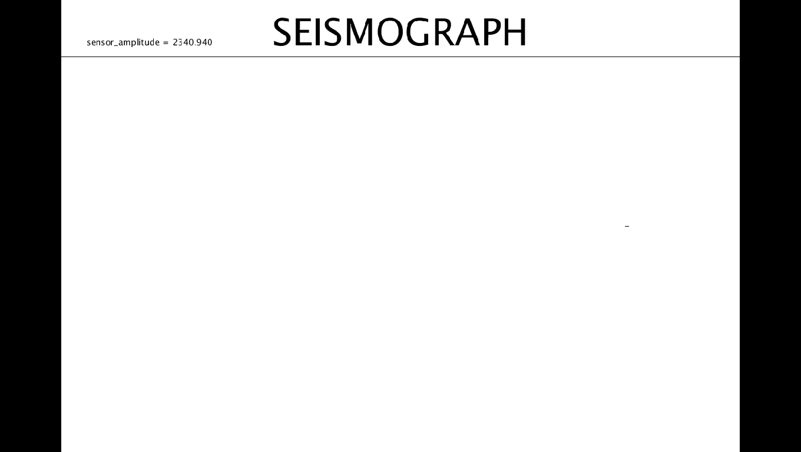

# Seismograph - (Arduino + Processing)

`Arduino` + `Processing` GUI  application to monitor and log seismic activity and detect earth quakes.

---

- Uses `MPU6050 accelerometer` with an `Arduino Nano `

- **Accelerometer** sensor mounted on a pendulum bob whose *neutral* position is detected by an `IR proximity sensor`.

- Whenever the pendulum is disturbed from its neutral position due to seismic activity, the data of the accelerometer is  plotted on the screeen and *logged* to the device using the **Processing GUI application**. 

- The GUI app saves *screenshots* of the plots after every wave and logs the sensor data to a `CSV` file for later analysis.

- The app uses `Serial` protocol to communicate and get data from the accelerometer, via the `Arduino Nano` using a USB cable connecting the Arduino and the PC running the application.

- The Arduino and MPU6050 use the `I2C` protocol for communication.

  ---

  